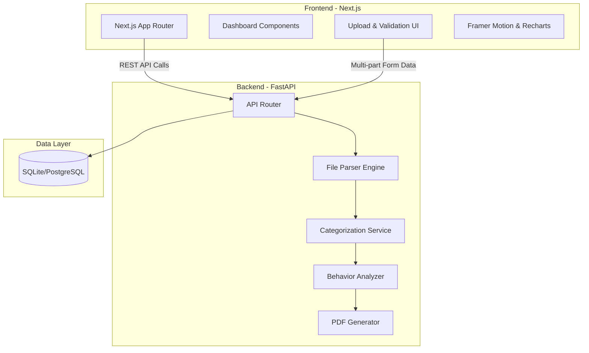

<div align="center">
  <h1>Finance Behavior Analyzer</h1>
  <p>
    <strong>A full-stack, AI-ready application for deeply analyzing personal finance behavior.</strong>
  </p>

  <!-- Badges -->
  <p>
    
    
    
    
    
  </p>
</div>

---

## 🌟 Overview

The **AI Personal Finance Behavior Analyzer** goes beyond traditional budgeting tools by taking a deep dive into user spending habits. It ingests messy, unstructured bank statement files (CSV, Excel), normalizes the data through an advanced parser, categorizes transactions, and identifies behavioral anomalies and patterns. It presents these insights through an interactive, visually rich Next.js dashboard and can generate comprehensive PDF reports.

## 🚀 Key Features

- **Robust Universal Parser:** Intelligently handles a wide variety of statement formats (CSV, TSV, XLSX, etc.) with automatic column mapping and data cleaning.
- **Hybrid Categorization Engine:** Employs a blazing-fast keyword-matching heuristic engine out of the box, cleanly abstracted to be seamlessly swapped with an LLM-based categorization strategy in the future.
- **Behavioral Analytics:** Detects spending anomalies, lifestyle inflation, subscription fatigue, and category-specific trends over time.
- **Interactive Dashboards:** Built with beautiful visualizations using Recharts and Framer Motion, enabling users to explore their data interactively.
- **PDF Reporting:** Generates high-quality, professional PDF reports summarizing financial health, ready for export.
- **Privacy-First Design:** Transactions can be processed locally utilizing an SQLite backend, ensuring user data remains secure during analysis.

## 🏗 Architecture

The system is decoupled into a robust REST API backend and a dynamic frontend dashboard.



## 🛠 Tech Stack

### Frontend (`/client`)
- **Framework:** Next.js (App Router), React
- **Styling:** Tailwind CSS
- **Animations & Visuals:** Framer Motion, Recharts
- **State & Data Fetching:** Custom React Hooks

### Backend (`/server`)
- **Framework:** FastAPI, Uvicorn
- **Data Validation:** Pydantic
- **ORM:** SQLAlchemy
- **Database:** SQLite (Local Dev) / PostgreSQL (Production)
- **PDF Generation:** ReportLab

---

## 🌐 Live Demo & Data

Check out the live application hosted in production:
- **Live Demo:** [https://client-six-rho-98.vercel.app/](https://client-six-rho-98.vercel.app/)
- **Sample Dataset:** [Download Sample CSV](https://drive.google.com/file/d/1rzVFTkBZ-VS6ay0WC_E7NU-2W1f-7b79/view?usp=sharing) (Use this to test the upload feature)

---

## 💻 Local Development

Follow these steps to run the project on your local machine.

### Prerequisites
- Node.js (v18+)
- Python (3.9+)
- Git

### 1. Start the Backend (FastAPI)

Open a terminal and navigate to the `server` directory:

```bash
cd server
python -m venv .venv

# Activate virtual environment
# Windows:
.\.venv\Scripts\Activate.ps1
# Mac/Linux:
source .venv/bin/activate

# Install dependencies
pip install -r requirements.txt

# Set up environment variables
cp .env.example .env

# Run the server
uvicorn main:app --reload --host 0.0.0.0 --port 8000
```
*The API documentation will be available at `http://localhost:8000/docs`.*

### 2. Start the Frontend (Next.js)

Open a new terminal and navigate to the `client` directory:

```bash
cd client

# Install dependencies
npm ci

# Set up environment variables
cp .env.example .env.local

# Start the development server
npm run dev
```
*The application will be running at `http://localhost:3000`.*

---

## 🧪 Validation & Testing

Ensure everything is compiling and building correctly before deploying:

**Backend Compilation Check:**
```bash
cd server
python -m compileall app main.py
```

**Frontend Build Check:**
```bash
cd client
npm run lint
npm run build
```

---

## ☁️ Deployment

This project is configured for cloud deployment across Vercel (Frontend) and Render (Backend).

- **Frontend Deployment:** The Next.js app is optimized for Vercel. Connect your repository to Vercel and it will automatically detect the `client` directory as the root.
- **Backend Deployment:** Uses `render.yaml` as an Infrastructure-as-Code blueprint to deploy the FastAPI application to Render.

For detailed deployment instructions, refer to [`docs/DEPLOYMENT.md`](docs/DEPLOYMENT.md) and [`docs/ENVIRONMENT.md`](docs/ENVIRONMENT.md).

> **Important Data Note:**
> SQLite databases and uploaded files are preserved locally but ignored by Git. For production, ensure you migrate to a managed storage provider (like AWS S3) and a managed PostgreSQL database.

---
*Created as a comprehensive demonstration of full-stack data engineering, AI readiness, and modern web application development.*
